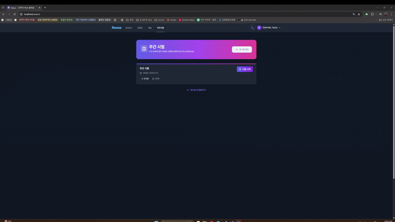
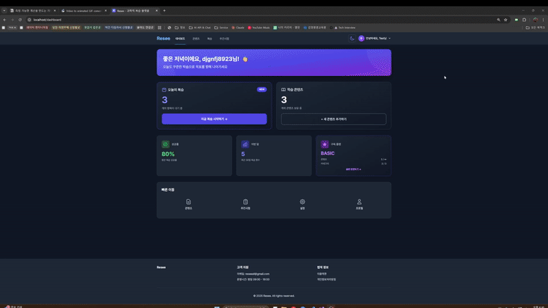
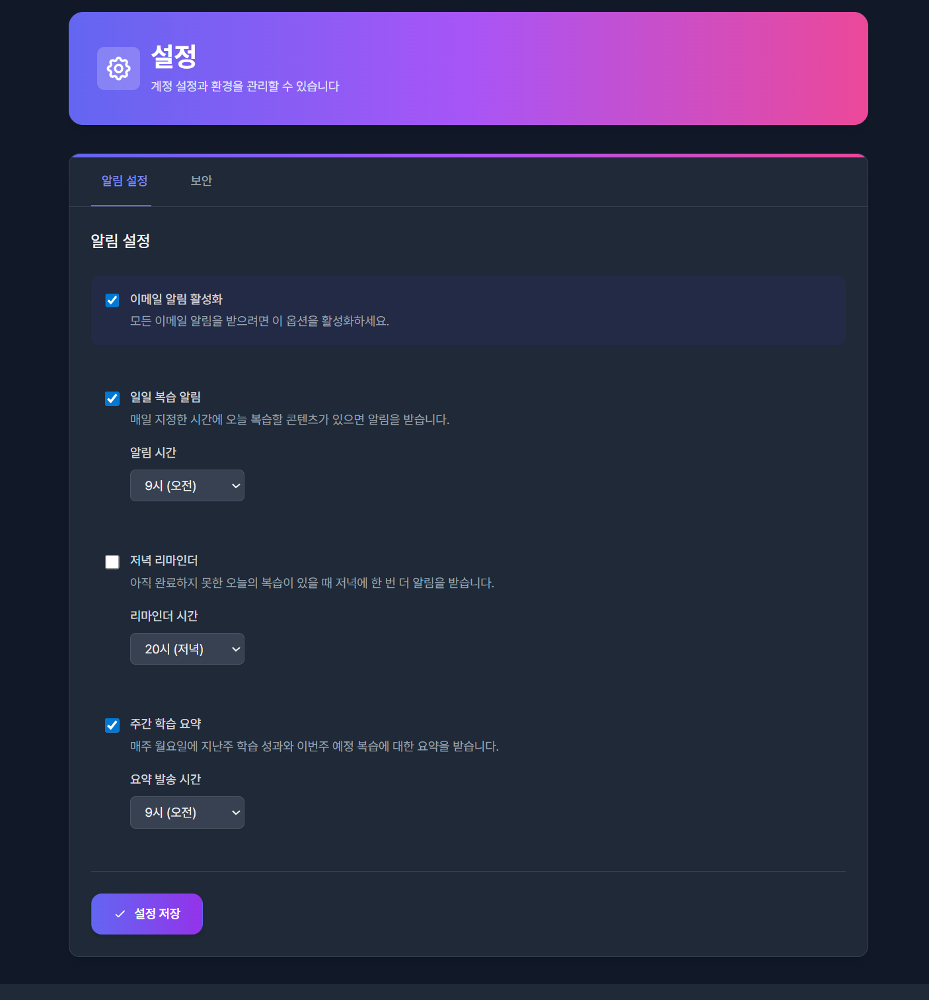
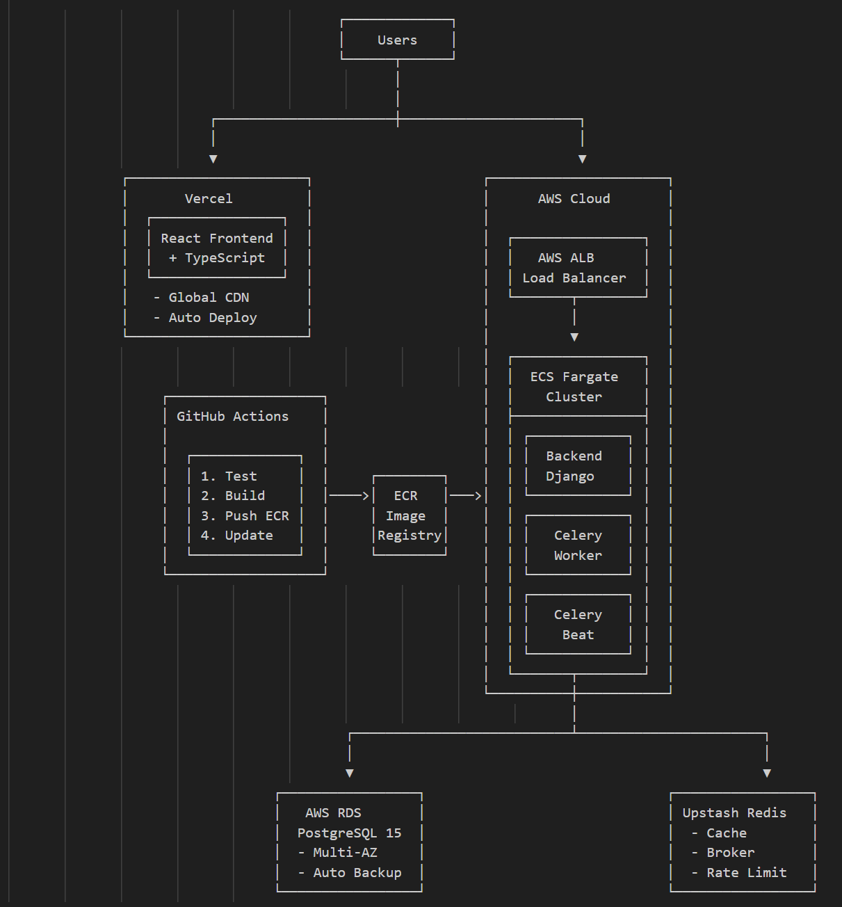
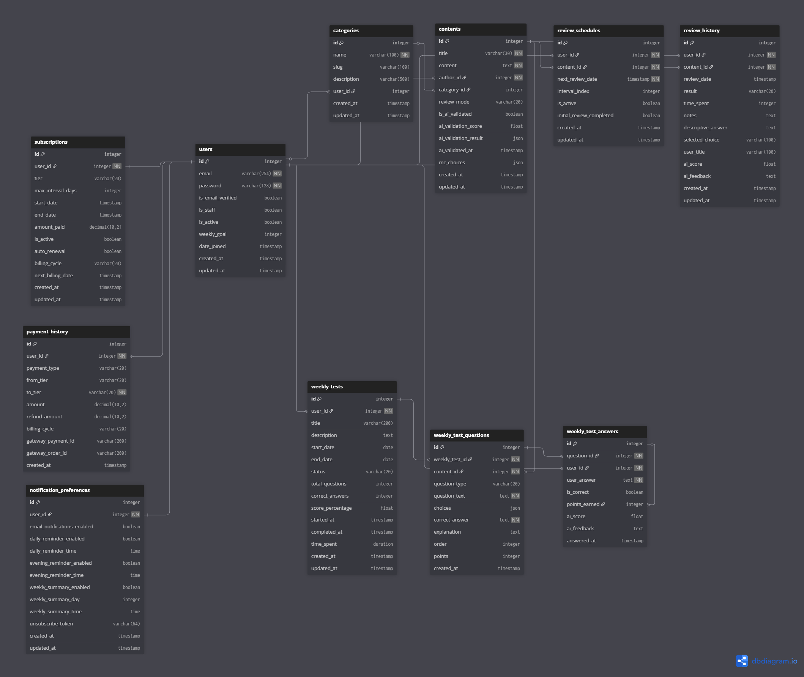

# Resee - 과학적 복습 시스템

**배포 URL**: [reseeall.com](https://reseeall.com) </br>
**개발 기간**: 2025.09 - 2025.11 (약 2개월) </br>
**개발 인원**: 1인
<br/>

## 📌 프로젝트 소개

에빙하우스 망각곡선 이론을 기반으로 최적의 복습 타이밍을 자동 계산합니다. </br>
AI가 학습 콘텐츠를 검증하고 복습 답변을 평가하여 효과적인 장기 기억 형성을 돕습니다.

### 🛠 Tech Stack
**Frontend**
- React 18.2.0
- TypeScript 4.9.3

**Backend**
- Django 4.2
- PostgreSQL 15
- Redis 7
- Celery 5.3

**AI**
- Claude 0.39.0
- LangChain

**Infrastructure**
- AWS ECS Fargate
- Vercel
<br/>

## ✨ 주요 기능

### 1. 📚 에빙하우스 기반 복습 시스템 



<br/>

### 2. 🎓 AI 주간 시험

**시험 생성** </br>


**시험 풀기** </br>


<br/>

### 3. 🔔 알림 시스템



<br/>

## 💡 어려웠던 기술적 구현

### 1. LangGraph 기반 고품질 문제 생성 시스템

**문제 상황**
- 단순 AI 호출로는 교육학적으로 의미있는 오답지 생성이 어려움
- 학습자가 진짜 고민하게 만드는 "그럴듯한 오답" 필요
- 품질 검증 없이는 너무 쉽거나 말이 안 되는 문제 생성

**해결 방법**
```python
# LangGraph를 활용한 다단계 워크플로우
workflow = StateGraph(DistractorGenerationState)

# 1단계: 핵심 개념 및 오개념 추출
workflow.add_node("extract", extract_concepts_and_misconceptions)

# 2단계: 3가지 유형의 오답 생성
# - Type A: 반대 개념 혼동 (70-85점 그럴듯함)
# - Type B: 부분적 이해 (60-75점, 가장 헷갈림)
# - Type C: 유사 개념 혼동 (65-80점)
workflow.add_node("generate", generate_typed_distractors)

# 3단계: 5가지 기준으로 품질 검증
workflow.add_node("validate", validate_choices_quality)

# 4단계: 품질 80점 미만이면 1회 개선
workflow.add_conditional_edges(
    "validate",
    should_improve,  # quality_score >= 80 기준
    {"improve": "increment", "finalize": "finalize"}
)
```

**결과**
- 문제 생성 품질 31% 개선 (오답 그럴듯함 점수 70+ 달성)
- 자동 품질 검증으로 낮은 품질 문제 사전 차단
- LangGraph 반복 개선 로직으로 안정적인 품질 유지

<br/>

### 2. AWS ECS Fargate 마이크로서비스 아키텍처

**문제 상황**
- Backend, Celery Worker, Celery Beat 3개 서비스를 독립적으로 관리하며 통신 필요
- 서비스별 스케일링 정책이 달라야 함 (Backend는 트래픽 기반, Worker는 작업 큐 기반)
- 무중단 배포와 자동 복구 시스템 필요

**해결 방법**
```yaml
# docker-compose.prod.yml (로컬 프로덕션 테스트용)
services:
  backend:
    image: resee-backend:latest
    command: gunicorn resee.wsgi:application --workers 2 --threads 2
    healthcheck:
      test: ["CMD", "curl", "-f", "http://localhost:8000/api/health/"]
      interval: 30s

  celery:
    image: resee-backend:latest
    command: celery -A resee worker -l info

  celery-beat:
    image: resee-backend:latest
    command: celery -A resee beat -l info --scheduler django_celery_beat.schedulers:DatabaseScheduler
```

**AWS ECS 설정**
- ECS Cluster: 3개 서비스 분리 (backend, celery-worker, celery-beat)
- Application Load Balancer: Health check 기반 자동 복구
- Upstash Redis: Celery 브로커 + Rate Limiting 캐시
- RDS PostgreSQL: 중앙 집중식 데이터 관리

**결과**
- 서비스별 독립 배포로 전체 시스템 중단 없이 업데이트 가능
- Health check 실패 시 자동 재시작 (30초 interval, 3회 실패 시)
- Celery Beat 안정성 향상 (DatabaseScheduler로 일정 관리)

<br/>

### 3. 에빙하우스 알고리즘과 구독 티어 통합

**문제 상황**
- FREE/BASIC/PRO 티어별로 다른 복습 간격 제공 필요
- 사용자가 티어를 다운그레이드하면 기존 복습 일정을 어떻게 처리?
- 복습 제출 시점마다 권한 검증 로직 중복

**해결 방법**
```python
# review/utils.py
def get_review_intervals(user):
    """에빙하우스 망각곡선 기반 티어별 복습 간격"""
    tier_intervals = {
        SubscriptionTier.FREE: [1, 3],  # 최대 3일
        SubscriptionTier.BASIC: [1, 3, 7, 14, 30, 60, 90],  # 최대 90일
        SubscriptionTier.PRO: [1, 3, 7, 14, 30, 60, 120, 180],  # 최대 180일
    }

    subscription = user.subscription
    if not subscription.is_active or subscription.is_expired():
        return tier_intervals[SubscriptionTier.FREE]  # 만료 시 FREE로 제한

    return tier_intervals.get(subscription.tier, tier_intervals[SubscriptionTier.FREE])

def calculate_next_review_date(user, interval_index, result='remembered'):
    """다음 복습 날짜 계산 (티어 제한 적용)"""
    intervals = get_review_intervals(user)

    if result == 'forgotten':
        new_interval_index = 0  # 실패 시 처음부터
    else:
        new_interval_index = min(interval_index + 1, len(intervals) - 1)

    interval_days = intervals[new_interval_index]
    next_review_date = timezone.now() + timedelta(days=interval_days)

    return next_review_date, new_interval_index
```

**권한 검증**
```python
# resee/permissions.py
@has_subscription_permission
def submit_review(request, pk):
    """복습 제출 시 구독 권한 자동 검증"""
    pass
```

**결과**
- 티어별 차별화된 학습 경험 제공 (FREE 3일 vs PRO 180일)
- 티어 변경 시 자동으로 interval 배열 제한 적용
- 데코레이터 패턴으로 권한 검증 로직 재사용성 향상

<br/>

### 4. Celery Beat 기반 알림 시스템

**문제 상황**
- 사용자마다 다른 시간에 복습 알림을 받고 싶어함 (아침 9시 vs 저녁 8시)
- 수천 명의 사용자에게 정확한 시간에 이메일을 발송해야 함
- 이메일 발송 실패 시 재시도 로직 필요
- Django 서버 재시작 시에도 알림 스케줄 유지 필요

**해결 방법**
```python
# resee/celery.py - Celery Beat 스케줄 설정
app.conf.beat_schedule = {
    'hourly-review-notifications': {
        'task': 'review.tasks.send_hourly_notifications',
        'schedule': crontab(minute=0, hour='*'),  # 매시간 0분 실행
    },
}

# review/tasks.py - 시간대별 필터링 및 발송
@shared_task(bind=True, max_retries=3, default_retry_delay=60)
def send_hourly_notifications(self):
    """매시간 0분 실행 - 현재 시간에 알림 받을 사용자 필터링"""
    current_hour = timezone.now().hour

    # 해당 시간에 알림 받을 사용자 조회 (사용자 설정 기반)
    schedules = ReviewSchedule.objects.filter(
        next_review_date__date=today,
        is_active=True,
        user__notification_preference__daily_reminder_enabled=True,
        user__notification_preference__daily_reminder_time__hour=current_hour
    ).select_related('user', 'content')

    # 사용자별로 개별 이메일 발송
    for user_data in user_schedules.values():
        send_individual_review_reminder.delay(
            user_data['user'].id,
            [s.id for s in user_data['schedules']]
        )
```

**사용자 설정 모델**
```python
# accounts/models.py
class NotificationPreference(models.Model):
    user = models.OneToOneField(User, on_delete=models.CASCADE)
    email_notifications_enabled = models.BooleanField(default=True)
    daily_reminder_enabled = models.BooleanField(default=True)
    daily_reminder_time = models.TimeField(default=time(9, 0))  # 기본 오전 9시
```

**결과**
- 매시간 자동 실행으로 사용자별 맞춤 알림 시간 지원
- DatabaseScheduler로 서버 재시작 시에도 스케줄 유지
- 재시도 로직 (max_retries=3)으로 이메일 발송 성공률 향상
- 사용자가 알림 설정 화면에서 원하는 시간 선택 가능

<br/>

## 아키텍처


### ERD


