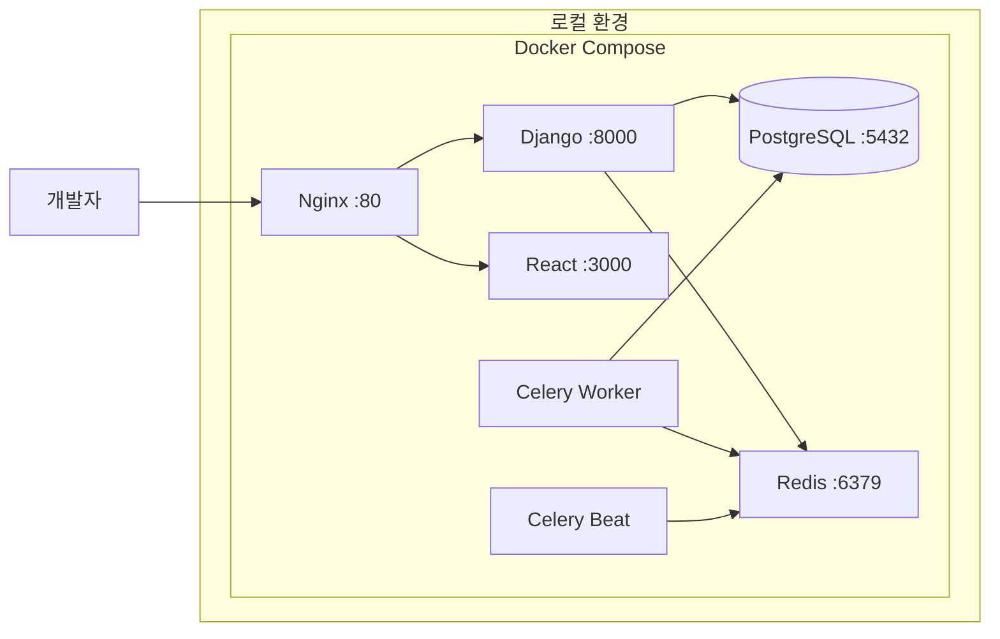
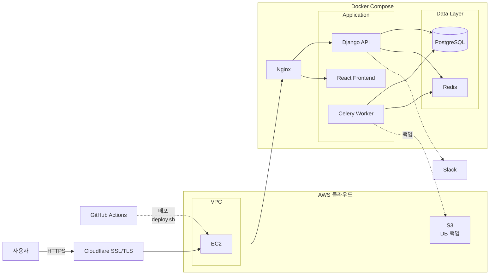
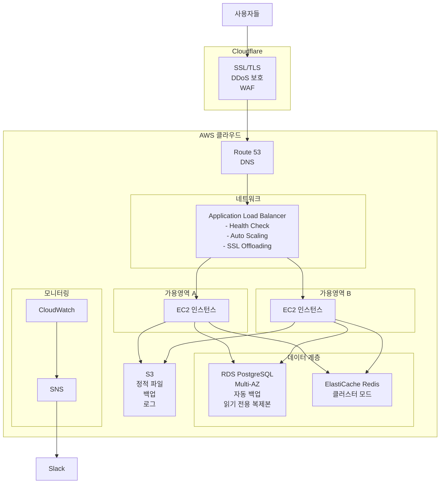

# Resee 프로젝트 아키텍처 발전 단계

## 목차
1. [1단계: 로컬 개발 환경](#1단계-로컬-개발-환경)
2. [2단계: AWS 기본 배포 (현재)](#2단계-aws-기본-배포-현재)
3. [3단계: 프로덕션 고급 아키텍처](#3단계-프로덕션-고급-아키텍처)

---

## 1단계: 로컬 개발 환경

### 개요
Docker Compose를 활용한 로컬 개발 환경. 모든 서비스가 단일 머신에서 실행됩니다.

### 아키텍처



### 주요 특징

| 항목 | 설명 |
|------|------|
| **배포 방식** | `docker-compose up` 한 번에 모든 서비스 실행 |
| **네트워크** | Docker 내부 네트워크 (bridge) |
| **데이터베이스** | PostgreSQL 15 (Docker 컨테이너) |
| **캐시/큐** | Redis 7 (Docker 컨테이너) |
| **백업** | 로컬 볼륨 마운트 |
| **모니터링** | 없음 (로그만 확인) |
| **비용** | **무료** (로컬 리소스만 사용) |

### 장점
- ✅ 빠른 개발 및 테스트
- ✅ 인터넷 연결 없이도 작업 가능
- ✅ 비용 제로
- ✅ 환경 재현이 쉬움 (docker-compose.yml)

### 단점
- ❌ 외부 접근 불가 (localhost만)
- ❌ 확장성 제한
- ❌ 프로덕션 환경과 차이 존재
- ❌ SSL/TLS 없음

### 기술 스택
```yaml
Frontend:
  - React 18.2.0
  - TypeScript 4.9.3
  - Tailwind CSS 3.2.4

Backend:
  - Django 4.2
  - Django REST Framework
  - Gunicorn

Database:
  - PostgreSQL 15
  - Redis 7

Task Queue:
  - Celery 5.3
  - Celery Beat
```

---

## 2단계: AWS 기본 배포 (현재)

### 개요
AWS EC2 + Cloudflare를 활용한 프로덕션 배포. 실제 사용자가 접근 가능한 서비스입니다.

### 아키텍처



### 주요 특징

| 항목 | 설명 |
|------|------|
| **배포 방식** | GitHub Actions → SSH → deploy.sh |
| **인프라** | AWS EC2 t3.medium (2 vCPU, 4GB RAM) |
| **네트워크** | Cloudflare (CDN + SSL) → AWS VPC |
| **데이터베이스** | PostgreSQL 15 (Docker 컨테이너) |
| **백업** | Celery 일일 백업 → S3 |
| **모니터링** | Slack 알림 (에러, 백업 성공/실패) |
| **비용** | 월 약 $15~20 (EC2 + S3 + 트래픽) |

### 1단계 대비 개선사항

#### 🔐 보안
- Cloudflare SSL/TLS 인증서 (HTTPS)
- AWS VPC 격리된 네트워크
- Security Groups 방화벽 규칙

#### 🌍 외부 접근
- 도메인 연결 가능
- 전 세계 어디서나 접근

#### 💾 백업 전략
- S3에 일일 자동 백업
- 원격 저장소 (재해 복구 가능)

#### 🔄 CI/CD
- GitHub Actions 자동 배포
- 테스트 자동화
- 배포 알림 (Slack)

### 아키텍처 결정 이유

#### Q1: 왜 EC2에서 Docker Compose를 사용하나요?
**A**:
- 개발 환경과 동일한 구조 유지 (환경 일치)
- 간단한 배포 프로세스 (`docker-compose up`)
- 적은 트래픽에 최적화 (오버엔지니어링 방지)

#### Q2: 왜 RDS가 아닌 Docker PostgreSQL을 사용하나요?
**A**:
- **비용**: RDS는 월 $15~30 추가, Docker는 무료
- **트래픽**: 현재 트래픽에는 단일 DB로 충분
- **백업**: S3 백업으로 재해 복구 가능

#### Q3: 왜 로드밸런서가 없나요?
**A**:
- **단일 인스턴스**: EC2 1대만 사용 중
- **트래픽**: 아직 스케일링이 필요한 수준 아님
- **비용 절감**: ALB는 월 $16~20 추가

### 배포 프로세스

```bash
# 1. 코드 푸시
git push origin main

# 2. GitHub Actions 자동 실행
- 테스트 실행 (pytest, npm test)
- 린팅 (black, eslint)
- 빌드 확인

# 3. SSH 배포
ssh ec2-user@server
./deploy.sh

# 4. deploy.sh 실행 내용
- git pull
- docker-compose build
- docker-compose up -d
- DB 마이그레이션
- Static 파일 수집

# 5. 배포 완료 알림
Slack으로 성공/실패 메시지 발송
```

### 비용 분석

| 항목 | 월 비용 | 비고 |
|------|---------|------|
| EC2 t3.medium | $15~18 | 예약 인스턴스 시 30% 할인 |
| S3 Storage | $0.5~1 | 백업 파일 (10GB 기준) |
| 네트워크 비용 | $1~2 | 아웃바운드 트래픽 |
| **합계** | **$17~21** | - |

💡 **절약 팁**: Cloudflare 무료 플랜으로 CDN + SSL 비용 제로

---

## 3단계: 프로덕션 고급 아키텍처

### 개요
대규모 트래픽 대응 가능한 고가용성 아키텍처. 자동 확장, 다중 가용 영역, 완전 관리형 서비스 활용.

### 아키텍처



### 2단계 대비 개선사항

#### 🏗️ 고가용성 (High Availability)

| 항목 | 2단계 | 3단계 | 개선 효과 |
|------|-------|-------|----------|
| **EC2** | 1대 | 2대 이상 (Multi-AZ) | 한 서버 다운되어도 서비스 유지 |
| **데이터베이스** | 단일 컨테이너 | RDS Multi-AZ | 자동 장애 조치 |
| **캐시** | 단일 Redis | ElastiCache 클러스터 | 데이터 복제 + 고가용성 |
| **로드밸런서** | 없음 | ALB | 트래픽 분산 + Health Check |

#### 📊 자동 확장 (Auto Scaling)

```yaml
Auto Scaling 정책:
  최소 인스턴스: 2
  최대 인스턴스: 10

  스케일 아웃 조건:
    - CPU 사용률 > 70% (5분 평균)
    - 요청 수 > 1000/분

  스케일 인 조건:
    - CPU 사용률 < 30% (10분 평균)
    - 요청 수 < 100/분
```

#### 💾 관리형 서비스

| 서비스 | 2단계 | 3단계 | 장점 |
|--------|-------|-------|------|
| **DB** | Docker PostgreSQL | RDS PostgreSQL | 자동 백업, 자동 패치, 모니터링 |
| **Cache** | Docker Redis | ElastiCache Redis | 자동 장애 조치, 스냅샷 |
| **로그** | 로컬 파일 | CloudWatch Logs | 중앙화된 로그 관리 + 검색 |
| **알림** | Slack만 | CloudWatch + SNS | 세밀한 알람 설정 |

#### 🔒 보안 강화

```yaml
보안 계층:
  1. Cloudflare WAF: SQL Injection, XSS 차단
  2. AWS Security Groups: 포트 레벨 방화벽
  3. IAM Roles: 서비스별 최소 권한
  4. RDS 암호화: 저장 데이터 암호화
  5. S3 버킷 정책: 접근 제어
```

#### 📈 모니터링 & 알람

```yaml
CloudWatch 메트릭:
  - CPU 사용률
  - 메모리 사용률
  - 디스크 I/O
  - 네트워크 트래픽
  - 응답 시간
  - 에러율
  - 데이터베이스 연결 수

알람 설정:
  Critical (즉시 알림):
    - EC2 인스턴스 다운
    - RDS 장애 조치
    - 에러율 > 5%
    - 응답 시간 > 3초

  Warning (30분 후 알림):
    - CPU > 80%
    - 디스크 사용률 > 85%
    - 메모리 > 90%
```

### 비용 분석

| 항목 | 2단계 | 3단계 | 증가액 |
|------|-------|-------|--------|
| **컴퓨팅** | EC2 1대: $18 | EC2 2대 + ALB: $52 | +$34 |
| **데이터베이스** | Docker: $0 | RDS Multi-AZ: $35 | +$35 |
| **캐시** | Docker: $0 | ElastiCache: $25 | +$25 |
| **스토리지** | S3: $1 | S3 + EBS: $5 | +$4 |
| **모니터링** | Slack: $0 | CloudWatch: $10 | +$10 |
| **네트워크** | $2 | $8 | +$6 |
| **합계** | **$21** | **$135** | **+$114** |

### 언제 3단계로 전환해야 하나?

#### ✅ 전환이 필요한 시점

1. **트래픽**
   - 동시 접속자 500명 이상
   - 일일 방문자 10,000명 이상
   - API 요청 100만 건/일 이상

2. **비즈니스 요구사항**
   - 99.9% 이상 가용성 필요
   - 다운타임 0분 목표
   - 데이터 손실 절대 불가

3. **팀 성장**
   - 개발팀 5명 이상
   - 24/7 운영 필요
   - 글로벌 서비스 제공

4. **매출 발생**
   - 월 매출 $10,000 이상
   - 다운타임당 손실 > 인프라 비용

#### ❌ 아직 필요 없는 경우

1. **초기 스타트업**
   - MVP 검증 단계
   - 일일 방문자 < 1,000명
   - 비용 절감이 우선

2. **개인 프로젝트**
   - 포트폴리오 용도
   - 학습 목적
   - 비용 부담

### 마이그레이션 계획 (2단계 → 3단계)

#### 단계별 전환 (무중단 배포)

```yaml
Phase 1: RDS 마이그레이션 (1주)
  1. RDS 인스턴스 생성
  2. 데이터 복제 (pg_dump → RDS)
  3. 애플리케이션 연결 전환
  4. Docker PostgreSQL 제거

Phase 2: ElastiCache 전환 (3일)
  1. ElastiCache 클러스터 생성
  2. 애플리케이션 연결 전환
  3. 데이터 워밍업
  4. Docker Redis 제거

Phase 3: 로드밸런서 추가 (1주)
  1. ALB 생성
  2. Target Group 설정
  3. Health Check 구성
  4. DNS 전환

Phase 4: Auto Scaling 구성 (3일)
  1. AMI 생성
  2. Launch Template 작성
  3. Auto Scaling Group 생성
  4. 스케일링 정책 설정

Phase 5: 모니터링 강화 (1주)
  1. CloudWatch 에이전트 설치
  2. 커스텀 메트릭 추가
  3. 알람 설정
  4. 대시보드 구성

총 소요 시간: 약 3~4주
```

---

## 단계별 비교 요약

| 항목 | 1단계<br/>로컬 개발 | 2단계<br/>AWS 기본 (현재) | 3단계<br/>프로덕션 고급 |
|------|---------------------|---------------------------|------------------------|
| **목적** | 개발 & 테스트 | 실제 서비스 운영 | 대규모 서비스 |
| **가용성** | - | 99% (단일 장애점 존재) | 99.9% (Multi-AZ) |
| **확장성** | 없음 | 수동 (EC2 크기 변경) | 자동 (Auto Scaling) |
| **비용** | $0 | $20/월 | $135/월 |
| **복잡도** | 낮음 ⭐ | 중간 ⭐⭐ | 높음 ⭐⭐⭐⭐ |
| **유지보수** | 쉬움 | 보통 | 어려움 (전문 지식 필요) |
| **적합한 경우** | 개발 단계 | 초기 서비스<br/>MVP 검증<br/>트래픽 < 1000/일 | 성장 단계<br/>트래픽 > 10000/일<br/>매출 발생 |

---

## 현재 프로젝트 권장 사항

### ✅ 2단계 유지 (현재 구조)

**이유**:
1. **적절한 비용**: 월 $20로 실제 서비스 운영 가능
2. **충분한 성능**: 현재 트래픽 수준에 적합
3. **간단한 관리**: 개인/소규모 팀이 운영 가능
4. **빠른 개발**: 복잡한 인프라 관리 없이 기능 개발에 집중

### 📈 3단계 전환 시점

다음 중 **하나라도 해당**되면 고려:
- [ ] 일일 방문자 5,000명 돌파
- [ ] 다운타임으로 인한 손실 발생
- [ ] 투자 유치 또는 매출 발생
- [ ] 개발팀 3명 이상으로 확대
- [ ] 글로벌 서비스 확장

---

## 결론

### 각 단계의 핵심 가치

**1단계**: 빠른 개발과 실험
- 완벽한 개발 환경 = 프로덕션과 동일한 구조

**2단계**: 최소 비용으로 실제 서비스
- 실용적인 선택 = 필요한 기능만, 적절한 비용

**3단계**: 비즈니스 성장을 위한 확장
- 기술 투자 = 비즈니스 가치 극대화

### 현명한 아키텍처 선택

> "지금 당장 필요하지 않은 인프라에 투자하지 마라.
> 하지만 언제든 확장 가능하도록 설계하라."

**Resee 프로젝트는 2단계에서 3단계로의 전환이 명확하게 정의되어 있어,
비즈니스 성장에 따라 자연스럽게 확장 가능합니다.**

---

## 부록: 참고 자료

### 아키텍처 다이어그램 파일
- `docs/aws-architecture-simple.mmd`: 2단계 (현재)
- `docs/production-architecture.mmd`: 3단계 (고급)

### 관련 문서
- `CLAUDE.md`: 프로젝트 전체 개요
- `docker-compose.yml`: 1단계 & 2단계 설정
- `docker-compose.prod.yml`: 프로덕션 설정

### AWS 공식 문서
- [Well-Architected Framework](https://aws.amazon.com/architecture/well-architected/)
- [RDS Best Practices](https://docs.aws.amazon.com/AmazonRDS/latest/UserGuide/CHAP_BestPractices.html)
- [Auto Scaling Best Practices](https://docs.aws.amazon.com/autoscaling/ec2/userguide/as-best-practices.html)

---

**마지막 업데이트**: 2025-10-24
**작성자**: Resee 개발팀
