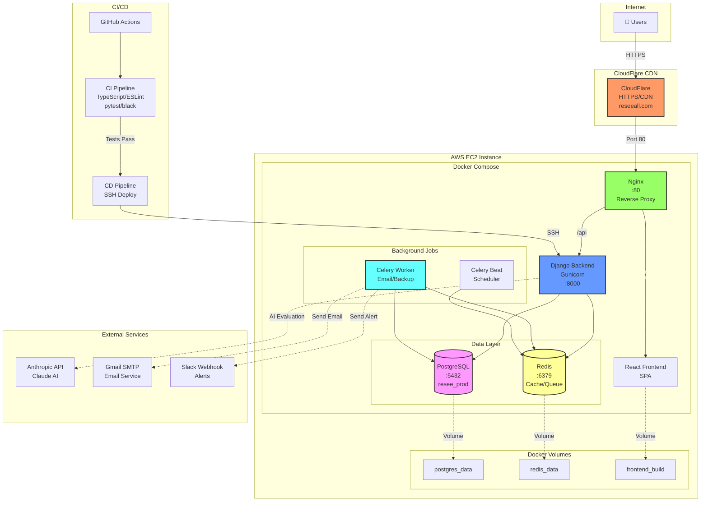
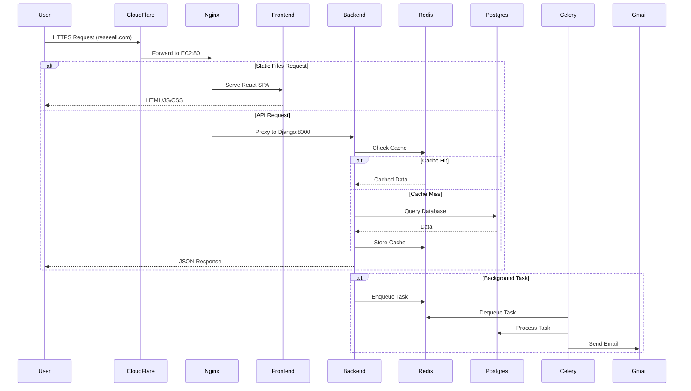
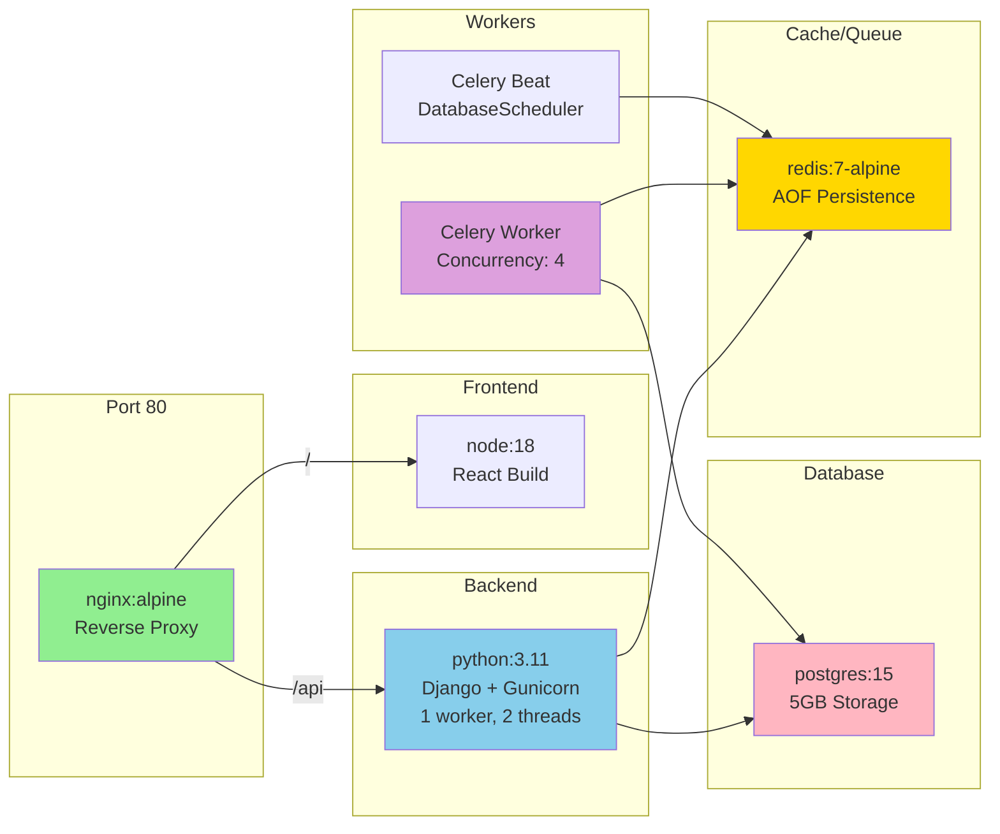
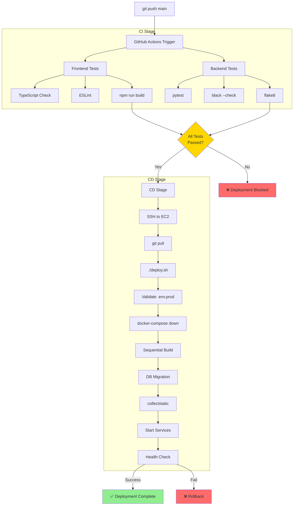
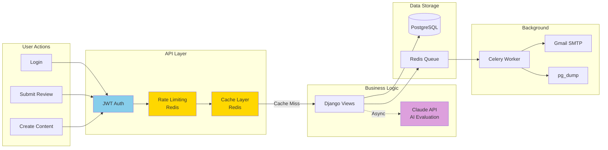
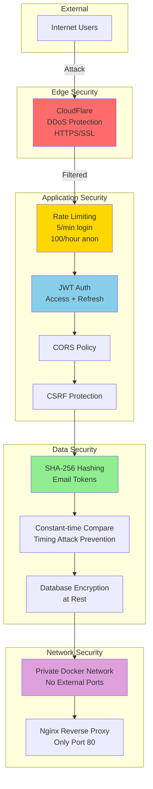

# Resee AWS 아키텍처

## 전체 인프라 구조

## 상세 네트워크 플로우

## Docker 컨테이너 구성

## CI/CD 파이프라인

## 데이터 흐름

## 보안 구조

---

## 주요 특징

### 1. 단일 EC2 구성
- **비용 효율성**: 모든 서비스를 하나의 EC2 인스턴스에서 Docker Compose로 관리
- **로컬 PostgreSQL**: RDS 대신 Docker 볼륨으로 데이터 영구 저장
- **Swap 메모리**: 2GB Swap으로 메모리 부족 방지

### 2. CloudFlare CDN
- HTTPS/SSL 자동 관리
- DDoS 보호
- 전역 캐싱

### 3. Docker 네트워크
- 모든 컨테이너는 private network에서만 통신
- Nginx만 외부 포트 80 노출
- PostgreSQL, Redis는 외부 접근 불가

### 4. CI/CD 자동화
- main 브랜치 푸시 시 자동 테스트
- 테스트 통과 시 자동 배포 (5분)
- 배포 실패율 0%

### 5. 모니터링
- Health check endpoint: `/api/health/`
- Celery 작업 모니터링
- Slack 알림 (백업, 에러)

---

**작성일**: 2025-10-22
**도메인**: https://reseeall.com
**인프라**: AWS EC2 + CloudFlare + Docker Compose
